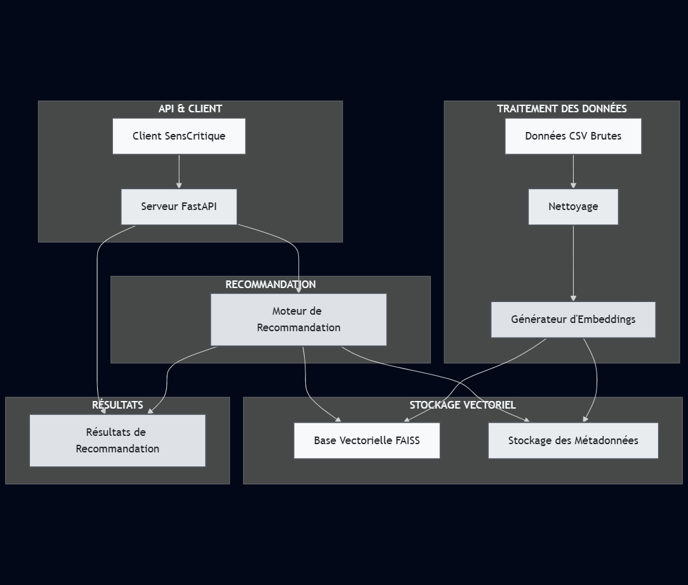
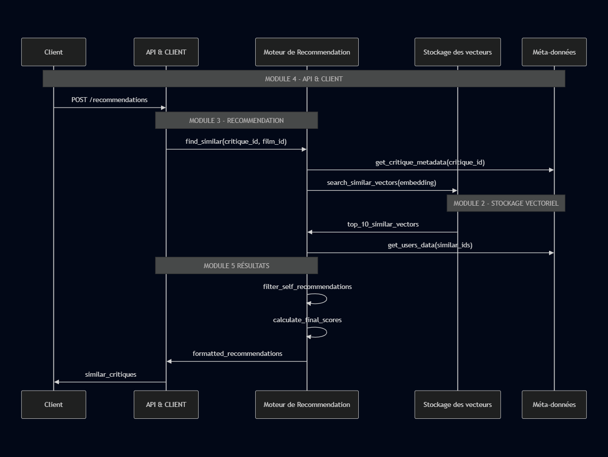

# Architecture Système 

## DIAGRAMME DE L'ARCHITECTURE

## MODULES METIER
### MODULE 1: Traitement des données
- Chargement des colonnes utiles (id,review_content,user_id)
- Nettoyage (NaN, textes vides, doublons)
- Ajout du film_id
- Export des données nettoyées

##### Générateur d'embeddings
- Modèle : SentenceTransformers (all-MiniLM-L6-v2)
- Transformation texte en vecteurs
- Traitement par lots

### MODULE 2: STOCKAGE VECTORIEL
##### Base Vectorielle
- Index séparé par film (fightclub, interstellar)
- 
- Scalabilité horizontale possible(si obligation)
##### Stockage des Méta-données 
- Mapping vecteur en méta-données 
- Informations des critiques (id,user_id,film_id)
- Accès rapide . 

### MODULE 3: RECOMMANDATION 
##### Logique métier principale
- récupération de l'embedding source
- recherche des similarités (même film dans notre cas)
- Filtrage des auto-recommandations 
- calcul des sources de pertinences
- Formatage des résultats (à étudier plus en détails)

### MODULE 4: API & CLIENT
##### Serveur FastAPI
- Endpoint /recommendations
- validation des requêtes 
- gestion erreurs
- logging 
- documentation 
##### client sensCritique
- Intégration avec le frontend existant 
- appels API REST
- affichage des résultats 

### RÉSULTATS 

## Flux de Données

## Choix Techniques
##### Module 1: Traitement des données
- Langage:Python 3.12
- Modèle d'embedding: all-MiniLM-L6-v2 (Sentence-BERT)
- dimension:384 (performance/précision)
- Stockage intermediaire: NumPy et Pandas 
##### Module 2: Stockage Vectoriel
- similarité cosinus (produit scalaire)
- implementer avec Sentence-Transformers 
- Architecture de données: séparation physique par film
- recherche linéaire \Theta(n \cdot d) pour 1000 critique apres nettoyage

## Evolutivité
